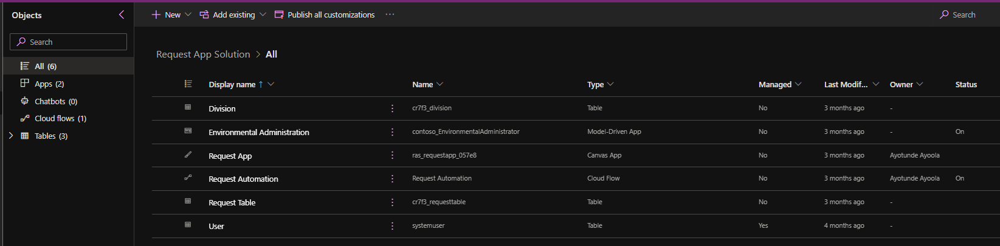

# Application Lifecycle Management

## Dataverse Environment Strategy

### Environment Types

- **Stringify DevOps**: This environment serves as the development instance where the application was built and this is where the source copy of the solution file unmanaged resides before deployment to a cloud repository.

- **Stringify UAT**: This is the environment that support User Acceptance Test, here the end-user/stakeholders of the solution are brough onboard to test the deployed managed solution.

- **Stringify Prod**: This is the live instance, where all solution users are able to engage the developed solution and use for the daily purpose of making request to work from home as stated in the project overview

### Environment Data Location

All environment are deployed in the North Amercian region specifically the United States region leveraging on that datacenter as that is where the data will be residing.

### Deployment Model

The deployment will follow the standard ALM process of pushing the solution from Dev - UAT - Production instance.

## Solution Strategy

### Nomenclature

- **Publisher**: requestappsolution
- **Prefix**: ras
- **Other PUblisher**: cr7f3 (environment publisher) used due to the addition of some environment features
- **Object Name**: ras_Objects

_See reference image below_: _note that the solution name and the publisher name are highlighted_

### Solution Objects

This Solution contain six objects
- One Model Driven Apps
- One Canvas Apps
- One Power Automate Cloud Flow
- Three Dataverse Tables

