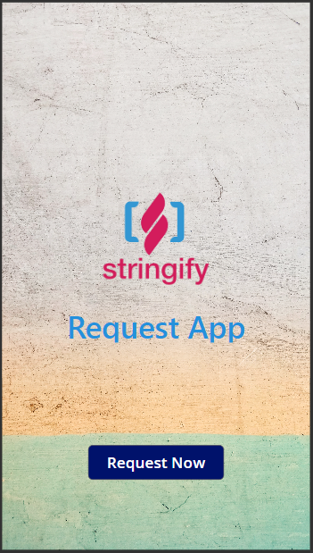
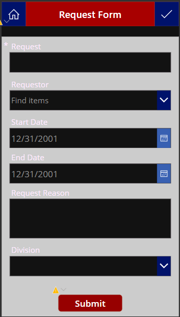
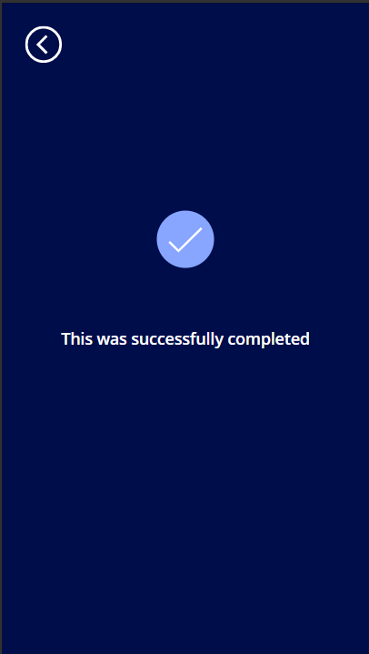

# dummySolution
This repository hold the entire project file for the Request App Solution, the documentations and the GitHub actions for committing changes and deployment.

# Solution Overview
This Solution is developed to enable staffs of an organization request for work from home.
[Click Here!](https://apps.powerapps.com/play/e/c2cb97ea-5be4-e428-91e9-0ea7c802630b/a/f61887d3-093e-43b2-9d53-c8379a927c6d?tenantId=50664edc-62d1-46f8-b702-a1374f8017d9) to access the application.

## Solution Justification
The solution eliminate the use of manual approach to request for days off from on-site work, also, the solution tracks the request based on specific days set for the such request and displays a warning error if days are exceeded on the User Interface of the end-user Canvas Apps.

## Solution Taxonomy
Below are the listed order through which this solution was developed, after which each element of the deployment will be documented accordingly.

1. **Business requirement document evaluation.**

    - Problem review.
    - Use case discovery.
    - Design conceptualization.
    - FitGap Analysis.
    - BluePrinting.

2. **Solution Design**

    - Data Modelling (_consisting of the E-R diagram splitted into your logical, object and physical diagrams_)
    - Security Modelling
    - ALM
    - Integrations Model (_if any_) 
    - 

3. **Project Management and Project Governance.**

    - Project Methodology (Agile or Waterfall).
    - Project Decision Model
    
 
 # Design Approach
 The project design model followed the UI - UX - Functionality model in the set order below.
 
    - User Interface design using Figma
    - The user interface was then transformed experiencially using Canvas Apps design object features
    - The application functionalities were developed using Power Fx
    
 _see the design outcome below_
 
           Home Screen           |          Request Screen         
 
              
   
          #Success Screen
   
 
