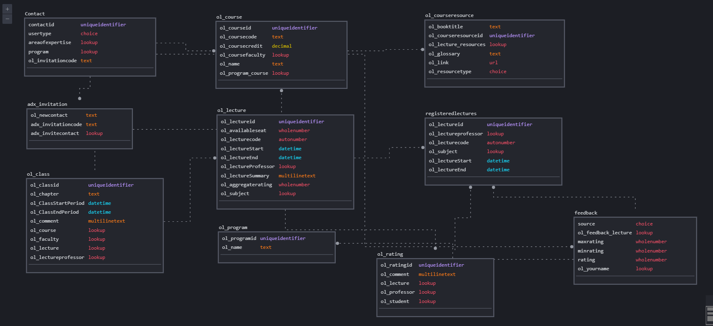
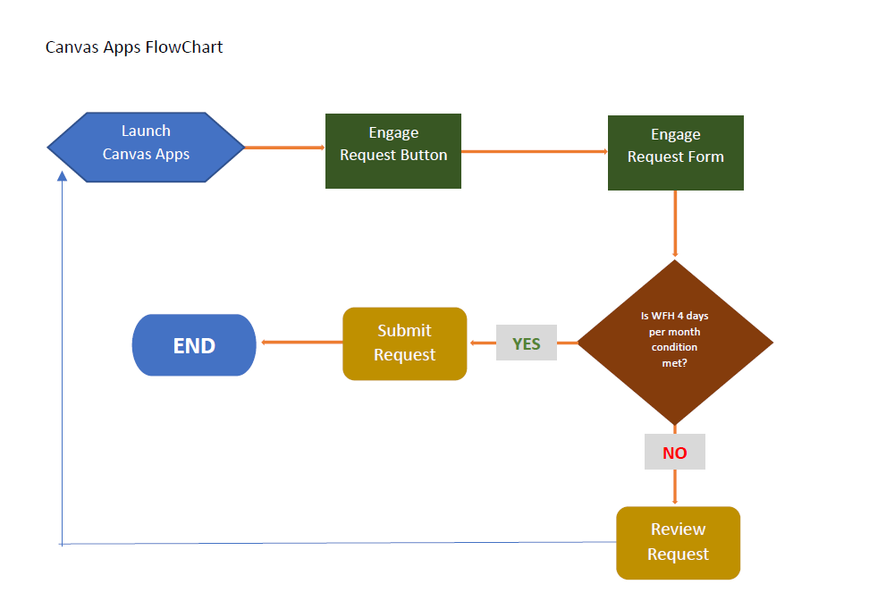
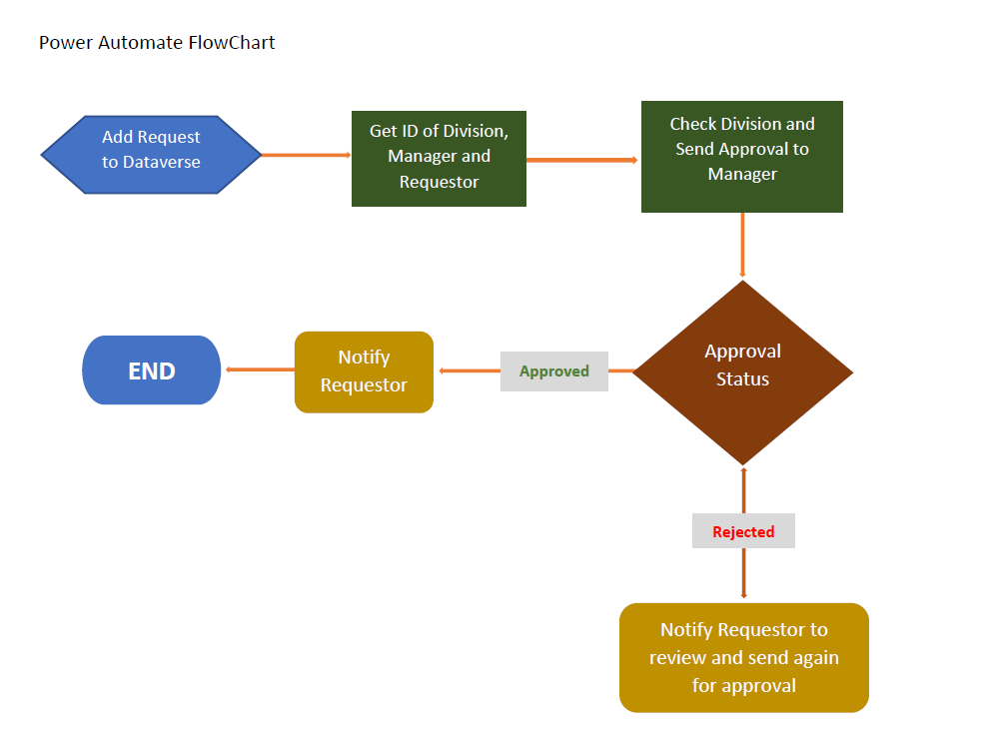
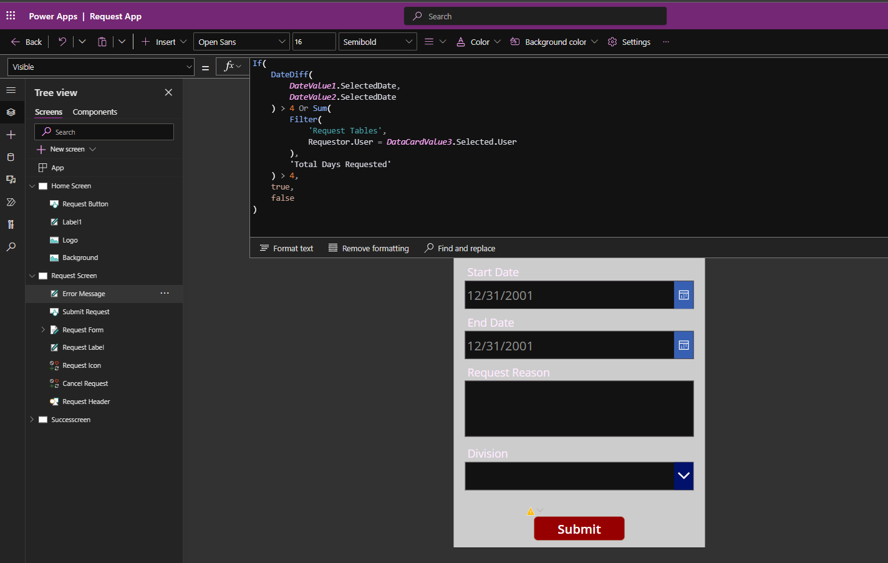

# The Request App Project Solution Structure

## Entity Relationship Diagram



## Flow Chart

#### Canvas Apps Flowchart

This chart shows the user journey from process initiation till finish.




### Power Automate Flow Chart

This flow charts shows the process model and journey of the implemented automation.




## Canvas Apps Function

The function used is called the Power Fx, and this was used in various part of the application to achieve the needed behaviours.

The image below shows the function written to check data difference as against each system user, to validate if the condition for the Work From Home request was met.

_Below is both the image and the function:_




Function is written on the "Visible" property
----
```Power Fx
If(
    DateDiff(
        DateValue1.SelectedDate,
        DateValue2.SelectedDate
    ) > 4 Or Sum(
        Filter(
            'Request Tables',
            Requestor.User = DataCardValue3.Selected.User
        ),
        'Total Days Requested'
    ) > 4,
    true,
    false
)
```
