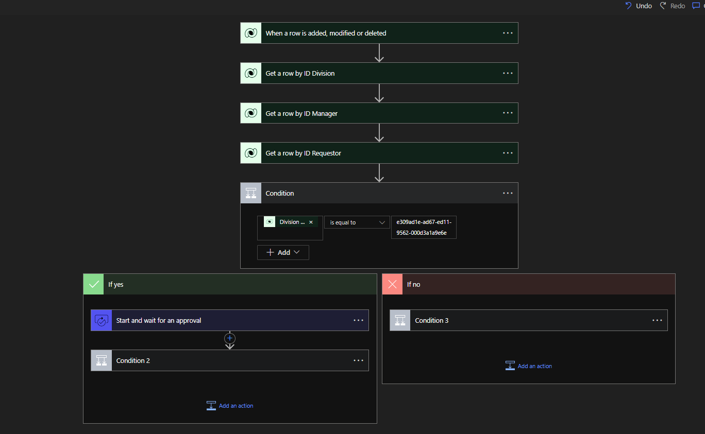

# The Request App Project Solution Structure

## Entity Relationship Diagram


## Flow Chart

#### Canvas Apps Flowchart

This chart shows the user journey from process initiation till finish.


#### Power Automate Flow Chart

This flow charts shows the process model and journey of the implemented automation.


## Dataverse Tables

As earlier seen above in the E-R diagam, the tables were then created.


## Canvas Apps Screens

#### Home Screen

Application User access the platform and by engaging with the "Request Now" button can go to the next screen to place a request.

 


#### Request Screen

Application User navigates from the Home Screen to the request screen and the user is able to submit Work From Home request, likewise if the set condition for success for this request is not met, the system throws an error with a  message as seen in the images below


## Canvas Apps Function

The function used is called the Power Fx, and this was used in various part of the application to achieve the needed behaviours.

The image below shows the function written to check data difference as against each system user, to validate if the condition for the Work From Home request was met.

_Below is both the image and the function:_


#### Function is written on the "Visible" property
----
```Power Fx
If(
    DateDiff(
        DateValue1.SelectedDate,
        DateValue2.SelectedDate
    ) > 4 Or Sum(
        Filter(
            'Request Tables',
            Requestor.User = DataCardValue3.Selected.User
        ),
        'Total Days Requested'
    ) > 4,
    true,
    false
)
```


## Power Automate Cloud Flows

The function used is called the Power Fx, and this was used in various part of the application to achieve the needed behaviours.

The image below shows the function written to check data difference as against each system user, to validate if the condition for the Work From Home request was met.

_Below is both the image and the function:_




## Testing and Go-Live

The following processes were taken during the testing exercise.

_kindly note that this process are not in the order listed_

- Performance test
- Regression test
- User Acceptance Test
- Data recovery test
- Dry runs were carried out with application stakeholders
- Checklist management as testing guide
- Integrations test
----

## **WAO!** 
And that wraps this body of work up.


